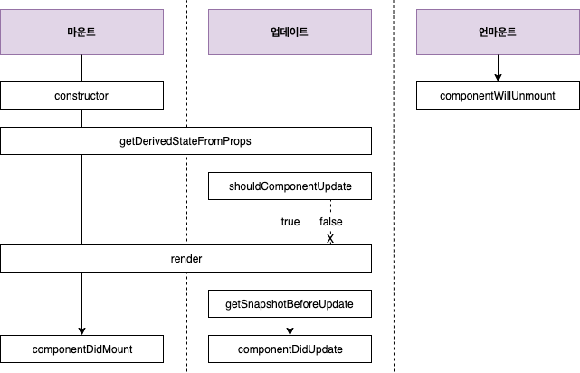

## 컴포넌트의 라이프사이클 메서드

컴포넌트 상태에 변화가 있을 때마다 실행하는 메서드

### 컴포넌트 업데이트 조건

- props가 바뀔 때
- state가 바뀔 때
- 부모 컴포넌트가 리렌더링될 때
- this.forceUpdate로 강제로 렌더링을 트리거할 때

### 에러 처리

- componentDidCatch

### 컴포넌트의 라이프사이클 메서드 흐름

